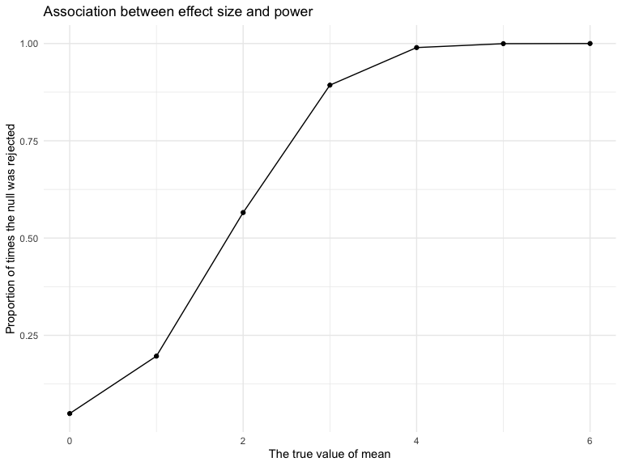
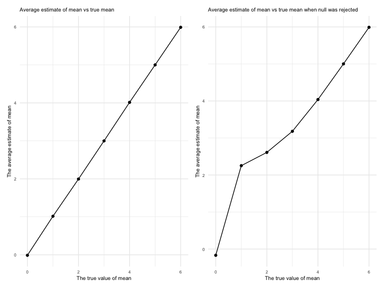

p8105_hw5_wy2369
================
Wenjing Yang
2022-11-13

# Problem 1

### Import the data

The code chunk below imports the data in individual spreadsheets
contained in `./data/zip_data/`. To do this, I create a dataframe that
includes the list of all files in that directory and the complete path
to each file.

As a next step, I `map` over paths and import data using the `read_csv`
function. Finally, I `unnest` the result of `map`.

``` r
full_df = 
  tibble(
    files = list.files("data/zip_data/"),
    path = str_c("data/zip_data/", files)
  ) %>% 
  mutate(data = map(path, read_csv)) %>% 
  unnest()
```

    ## Rows: 1 Columns: 8
    ## ── Column specification ────────────────────────────────────────────────────────
    ## Delimiter: ","
    ## dbl (8): week_1, week_2, week_3, week_4, week_5, week_6, week_7, week_8
    ## 
    ## ℹ Use `spec()` to retrieve the full column specification for this data.
    ## ℹ Specify the column types or set `show_col_types = FALSE` to quiet this message.
    ## Rows: 1 Columns: 8
    ## ── Column specification ────────────────────────────────────────────────────────
    ## Delimiter: ","
    ## dbl (8): week_1, week_2, week_3, week_4, week_5, week_6, week_7, week_8
    ## 
    ## ℹ Use `spec()` to retrieve the full column specification for this data.
    ## ℹ Specify the column types or set `show_col_types = FALSE` to quiet this message.
    ## Rows: 1 Columns: 8
    ## ── Column specification ────────────────────────────────────────────────────────
    ## Delimiter: ","
    ## dbl (8): week_1, week_2, week_3, week_4, week_5, week_6, week_7, week_8
    ## 
    ## ℹ Use `spec()` to retrieve the full column specification for this data.
    ## ℹ Specify the column types or set `show_col_types = FALSE` to quiet this message.
    ## Rows: 1 Columns: 8
    ## ── Column specification ────────────────────────────────────────────────────────
    ## Delimiter: ","
    ## dbl (8): week_1, week_2, week_3, week_4, week_5, week_6, week_7, week_8
    ## 
    ## ℹ Use `spec()` to retrieve the full column specification for this data.
    ## ℹ Specify the column types or set `show_col_types = FALSE` to quiet this message.
    ## Rows: 1 Columns: 8
    ## ── Column specification ────────────────────────────────────────────────────────
    ## Delimiter: ","
    ## dbl (8): week_1, week_2, week_3, week_4, week_5, week_6, week_7, week_8
    ## 
    ## ℹ Use `spec()` to retrieve the full column specification for this data.
    ## ℹ Specify the column types or set `show_col_types = FALSE` to quiet this message.
    ## Rows: 1 Columns: 8
    ## ── Column specification ────────────────────────────────────────────────────────
    ## Delimiter: ","
    ## dbl (8): week_1, week_2, week_3, week_4, week_5, week_6, week_7, week_8
    ## 
    ## ℹ Use `spec()` to retrieve the full column specification for this data.
    ## ℹ Specify the column types or set `show_col_types = FALSE` to quiet this message.
    ## Rows: 1 Columns: 8
    ## ── Column specification ────────────────────────────────────────────────────────
    ## Delimiter: ","
    ## dbl (8): week_1, week_2, week_3, week_4, week_5, week_6, week_7, week_8
    ## 
    ## ℹ Use `spec()` to retrieve the full column specification for this data.
    ## ℹ Specify the column types or set `show_col_types = FALSE` to quiet this message.
    ## Rows: 1 Columns: 8
    ## ── Column specification ────────────────────────────────────────────────────────
    ## Delimiter: ","
    ## dbl (8): week_1, week_2, week_3, week_4, week_5, week_6, week_7, week_8
    ## 
    ## ℹ Use `spec()` to retrieve the full column specification for this data.
    ## ℹ Specify the column types or set `show_col_types = FALSE` to quiet this message.
    ## Rows: 1 Columns: 8
    ## ── Column specification ────────────────────────────────────────────────────────
    ## Delimiter: ","
    ## dbl (8): week_1, week_2, week_3, week_4, week_5, week_6, week_7, week_8
    ## 
    ## ℹ Use `spec()` to retrieve the full column specification for this data.
    ## ℹ Specify the column types or set `show_col_types = FALSE` to quiet this message.
    ## Rows: 1 Columns: 8
    ## ── Column specification ────────────────────────────────────────────────────────
    ## Delimiter: ","
    ## dbl (8): week_1, week_2, week_3, week_4, week_5, week_6, week_7, week_8
    ## 
    ## ℹ Use `spec()` to retrieve the full column specification for this data.
    ## ℹ Specify the column types or set `show_col_types = FALSE` to quiet this message.
    ## Rows: 1 Columns: 8
    ## ── Column specification ────────────────────────────────────────────────────────
    ## Delimiter: ","
    ## dbl (8): week_1, week_2, week_3, week_4, week_5, week_6, week_7, week_8
    ## 
    ## ℹ Use `spec()` to retrieve the full column specification for this data.
    ## ℹ Specify the column types or set `show_col_types = FALSE` to quiet this message.
    ## Rows: 1 Columns: 8
    ## ── Column specification ────────────────────────────────────────────────────────
    ## Delimiter: ","
    ## dbl (8): week_1, week_2, week_3, week_4, week_5, week_6, week_7, week_8
    ## 
    ## ℹ Use `spec()` to retrieve the full column specification for this data.
    ## ℹ Specify the column types or set `show_col_types = FALSE` to quiet this message.
    ## Rows: 1 Columns: 8
    ## ── Column specification ────────────────────────────────────────────────────────
    ## Delimiter: ","
    ## dbl (8): week_1, week_2, week_3, week_4, week_5, week_6, week_7, week_8
    ## 
    ## ℹ Use `spec()` to retrieve the full column specification for this data.
    ## ℹ Specify the column types or set `show_col_types = FALSE` to quiet this message.
    ## Rows: 1 Columns: 8
    ## ── Column specification ────────────────────────────────────────────────────────
    ## Delimiter: ","
    ## dbl (8): week_1, week_2, week_3, week_4, week_5, week_6, week_7, week_8
    ## 
    ## ℹ Use `spec()` to retrieve the full column specification for this data.
    ## ℹ Specify the column types or set `show_col_types = FALSE` to quiet this message.
    ## Rows: 1 Columns: 8
    ## ── Column specification ────────────────────────────────────────────────────────
    ## Delimiter: ","
    ## dbl (8): week_1, week_2, week_3, week_4, week_5, week_6, week_7, week_8
    ## 
    ## ℹ Use `spec()` to retrieve the full column specification for this data.
    ## ℹ Specify the column types or set `show_col_types = FALSE` to quiet this message.
    ## Rows: 1 Columns: 8
    ## ── Column specification ────────────────────────────────────────────────────────
    ## Delimiter: ","
    ## dbl (8): week_1, week_2, week_3, week_4, week_5, week_6, week_7, week_8
    ## 
    ## ℹ Use `spec()` to retrieve the full column specification for this data.
    ## ℹ Specify the column types or set `show_col_types = FALSE` to quiet this message.
    ## Rows: 1 Columns: 8
    ## ── Column specification ────────────────────────────────────────────────────────
    ## Delimiter: ","
    ## dbl (8): week_1, week_2, week_3, week_4, week_5, week_6, week_7, week_8
    ## 
    ## ℹ Use `spec()` to retrieve the full column specification for this data.
    ## ℹ Specify the column types or set `show_col_types = FALSE` to quiet this message.
    ## Rows: 1 Columns: 8
    ## ── Column specification ────────────────────────────────────────────────────────
    ## Delimiter: ","
    ## dbl (8): week_1, week_2, week_3, week_4, week_5, week_6, week_7, week_8
    ## 
    ## ℹ Use `spec()` to retrieve the full column specification for this data.
    ## ℹ Specify the column types or set `show_col_types = FALSE` to quiet this message.
    ## Rows: 1 Columns: 8
    ## ── Column specification ────────────────────────────────────────────────────────
    ## Delimiter: ","
    ## dbl (8): week_1, week_2, week_3, week_4, week_5, week_6, week_7, week_8
    ## 
    ## ℹ Use `spec()` to retrieve the full column specification for this data.
    ## ℹ Specify the column types or set `show_col_types = FALSE` to quiet this message.
    ## Rows: 1 Columns: 8
    ## ── Column specification ────────────────────────────────────────────────────────
    ## Delimiter: ","
    ## dbl (8): week_1, week_2, week_3, week_4, week_5, week_6, week_7, week_8
    ## 
    ## ℹ Use `spec()` to retrieve the full column specification for this data.
    ## ℹ Specify the column types or set `show_col_types = FALSE` to quiet this message.

### Tidy the data

The result of the previous code chunk isn’t tidy – data are wide rather
than long, and some important variables are included as parts of others.
The code chunk below tides the data using string manipulations on the
file, converting from wide to long, and selecting relevant variables.

``` r
tidy_df = 
  full_df %>% 
  mutate(
    files = str_replace(files, ".csv", ""),
    group = str_sub(files, 1, 3)) %>% 
  pivot_longer(
    week_1:week_8,
    names_to = "week",
    values_to = "outcome",
    names_prefix = "week_") %>% 
  mutate(week = as.numeric(week)) %>% 
  select(group, subj = files, week, outcome)
```

### Make a plot

Finally, the code chunk below creates a plot showing individual data,
faceted by group.

``` r
tidy_df %>% 
  ggplot(aes(x = week, y = outcome, group = subj, color = group)) + 
  geom_point() + 
  geom_path() + 
  facet_grid(~group)
```


This plot suggests high within-subject correlation – subjects who start
above average end up above average, and those that start below average
end up below average. Subjects in the control group generally don’t
change over time, but those in the experiment group increase their
outcome in a roughly linear way.

# Problem 2

### Read and clean

Using the code chunk to read and clean data from `homicide-data.csv`

``` r
homicide_data = 
  read_csv("./data/homicide-data.csv") %>% 
  janitor::clean_names()
```

    ## Rows: 52179 Columns: 12
    ## ── Column specification ────────────────────────────────────────────────────────
    ## Delimiter: ","
    ## chr (9): uid, victim_last, victim_first, victim_race, victim_age, victim_sex...
    ## dbl (3): reported_date, lat, lon
    ## 
    ## ℹ Use `spec()` to retrieve the full column specification for this data.
    ## ℹ Specify the column types or set `show_col_types = FALSE` to quiet this message.

### Describe the raw data

In the raw data, there are **52179** rows and **12** columns. It
contains **12** important variables which are uid (`uid`), dates of
report (`reported_date`), last and first names of victim
(`victim_last`and `victim_first`), race of victim (`victim_race`), age
of victim (`victim_age`), sex of victim (`victim_sex`), variables of
location (`city`, `state`, `lat` and `lon` ), and the status of case
(`disposition`) from 50 large cities in the U.S.

### Create a `city_state` variable

Using mutate function to create a new variable.

``` r
homicide_df = 
  homicide_data %>% 
  mutate(city_state = str_c(city, ",", state)) 
```

### Find the total number of homicides within cities.

``` r
homicide_df %>% 
  group_by(city_state) %>% 
  count(city_state) %>% 
  summarize(n) 
```

    ## # A tibble: 51 × 2
    ##    city_state         n
    ##    <chr>          <int>
    ##  1 Albuquerque,NM   378
    ##  2 Atlanta,GA       973
    ##  3 Baltimore,MD    2827
    ##  4 Baton Rouge,LA   424
    ##  5 Birmingham,AL    800
    ##  6 Boston,MA        614
    ##  7 Buffalo,NY       521
    ##  8 Charlotte,NC     687
    ##  9 Chicago,IL      5535
    ## 10 Cincinnati,OH    694
    ## # … with 41 more rows

From this table, we could find the total number of homicides within 51
cities not 50, and there is one uncommon data from **Tulsa,AL**. Since I
know **Tulsa,AL** does not exist in the U.S, we should probably ignore
this data from `homicide_df` dataset.

### Find the number of unsolved homicides

``` r
tidy_homicide_df = 
  homicide_df %>% 
  filter(city_state != "Tulsa,AL") %>% 
  mutate(
    homicide_status =  ifelse(disposition != "Closed by arrest", "unsolved", "solved")
  )


Unsolve_data = 
  tidy_homicide_df %>% 
  group_by(city_state) %>% 
  summarize(
    unsolved = sum(homicide_status == "unsolved"),
    total_homicides = n())

Unsolve_data %>% 
    knitr::kable(col.names = c("city, state", "unsolved homicides", "total homicides"))
```

| city, state       | unsolved homicides | total homicides |
|:------------------|-------------------:|----------------:|
| Albuquerque,NM    |                146 |             378 |
| Atlanta,GA        |                373 |             973 |
| Baltimore,MD      |               1825 |            2827 |
| Baton Rouge,LA    |                196 |             424 |
| Birmingham,AL     |                347 |             800 |
| Boston,MA         |                310 |             614 |
| Buffalo,NY        |                319 |             521 |
| Charlotte,NC      |                206 |             687 |
| Chicago,IL        |               4073 |            5535 |
| Cincinnati,OH     |                309 |             694 |
| Columbus,OH       |                575 |            1084 |
| Dallas,TX         |                754 |            1567 |
| Denver,CO         |                169 |             312 |
| Detroit,MI        |               1482 |            2519 |
| Durham,NC         |                101 |             276 |
| Fort Worth,TX     |                255 |             549 |
| Fresno,CA         |                169 |             487 |
| Houston,TX        |               1493 |            2942 |
| Indianapolis,IN   |                594 |            1322 |
| Jacksonville,FL   |                597 |            1168 |
| Kansas City,MO    |                486 |            1190 |
| Las Vegas,NV      |                572 |            1381 |
| Long Beach,CA     |                156 |             378 |
| Los Angeles,CA    |               1106 |            2257 |
| Louisville,KY     |                261 |             576 |
| Memphis,TN        |                483 |            1514 |
| Miami,FL          |                450 |             744 |
| Milwaukee,wI      |                403 |            1115 |
| Minneapolis,MN    |                187 |             366 |
| Nashville,TN      |                278 |             767 |
| New Orleans,LA    |                930 |            1434 |
| New York,NY       |                243 |             627 |
| Oakland,CA        |                508 |             947 |
| Oklahoma City,OK  |                326 |             672 |
| Omaha,NE          |                169 |             409 |
| Philadelphia,PA   |               1360 |            3037 |
| Phoenix,AZ        |                504 |             914 |
| Pittsburgh,PA     |                337 |             631 |
| Richmond,VA       |                113 |             429 |
| Sacramento,CA     |                139 |             376 |
| San Antonio,TX    |                357 |             833 |
| San Bernardino,CA |                170 |             275 |
| San Diego,CA      |                175 |             461 |
| San Francisco,CA  |                336 |             663 |
| Savannah,GA       |                115 |             246 |
| St. Louis,MO      |                905 |            1677 |
| Stockton,CA       |                266 |             444 |
| Tampa,FL          |                 95 |             208 |
| Tulsa,OK          |                193 |             583 |
| Washington,DC     |                589 |            1345 |

From this table, we could find the total number of homicides within 50
cities and the number of unsolved homicides (those for which the
disposition is “Closed without arrest” or “Open/No arrest”).

### Estimate the proportion of homicides that are unsolved

Use the `prop.test` function to estimate the proportion of homicides
that are unsolved for the city of Baltimore, MD. ANd I pull the
estimated proportion and confidence intervals (CI) from the resulting
tidy dataframe.

``` r
Baltimore_data = 
  Unsolve_data %>%
  filter(city_state == "Baltimore,MD")

  
Baltimore_test = 
  prop.test(
    x = Baltimore_data %>% pull(unsolved),
    n = Baltimore_data %>% pull(total_homicides)) %>% 
  broom::tidy() %>% 
  select(estimate,conf.low,conf.high)

Baltimore_test
```

    ## # A tibble: 1 × 3
    ##   estimate conf.low conf.high
    ##      <dbl>    <dbl>     <dbl>
    ## 1    0.646    0.628     0.663

The test results tell us that the estimate proportion of homicides that
are unsolved for the city of Baltimore, MD is **0.646** and the 95%
confidence interval is **(0.628, 0.663)**.

### Estimate the proportion for all 50 cities.

``` r
all_test = 
  Unsolve_data %>% 
  mutate(
    proportion = map2(.x = unsolved, .y = total_homicides, ~prop.test(x = .x, n = .y)),
    proportion = map(proportion, broom::tidy)
  ) %>% 
  unnest() %>% 
  select(city_state, unsolved, total_homicides, estimate, conf.low,conf.high)
  
all_test %>% 
  knitr::kable(
    digits = 3,
    col.names = c("city, state", "unsolved cases", "total cases", "estimate proportion", "lower CI", "upper CI"))
```

| city, state       | unsolved cases | total cases | estimate proportion | lower CI | upper CI |
|:------------------|---------------:|------------:|--------------------:|---------:|---------:|
| Albuquerque,NM    |            146 |         378 |               0.386 |    0.337 |    0.438 |
| Atlanta,GA        |            373 |         973 |               0.383 |    0.353 |    0.415 |
| Baltimore,MD      |           1825 |        2827 |               0.646 |    0.628 |    0.663 |
| Baton Rouge,LA    |            196 |         424 |               0.462 |    0.414 |    0.511 |
| Birmingham,AL     |            347 |         800 |               0.434 |    0.399 |    0.469 |
| Boston,MA         |            310 |         614 |               0.505 |    0.465 |    0.545 |
| Buffalo,NY        |            319 |         521 |               0.612 |    0.569 |    0.654 |
| Charlotte,NC      |            206 |         687 |               0.300 |    0.266 |    0.336 |
| Chicago,IL        |           4073 |        5535 |               0.736 |    0.724 |    0.747 |
| Cincinnati,OH     |            309 |         694 |               0.445 |    0.408 |    0.483 |
| Columbus,OH       |            575 |        1084 |               0.530 |    0.500 |    0.560 |
| Dallas,TX         |            754 |        1567 |               0.481 |    0.456 |    0.506 |
| Denver,CO         |            169 |         312 |               0.542 |    0.485 |    0.598 |
| Detroit,MI        |           1482 |        2519 |               0.588 |    0.569 |    0.608 |
| Durham,NC         |            101 |         276 |               0.366 |    0.310 |    0.426 |
| Fort Worth,TX     |            255 |         549 |               0.464 |    0.422 |    0.507 |
| Fresno,CA         |            169 |         487 |               0.347 |    0.305 |    0.391 |
| Houston,TX        |           1493 |        2942 |               0.507 |    0.489 |    0.526 |
| Indianapolis,IN   |            594 |        1322 |               0.449 |    0.422 |    0.477 |
| Jacksonville,FL   |            597 |        1168 |               0.511 |    0.482 |    0.540 |
| Kansas City,MO    |            486 |        1190 |               0.408 |    0.380 |    0.437 |
| Las Vegas,NV      |            572 |        1381 |               0.414 |    0.388 |    0.441 |
| Long Beach,CA     |            156 |         378 |               0.413 |    0.363 |    0.464 |
| Los Angeles,CA    |           1106 |        2257 |               0.490 |    0.469 |    0.511 |
| Louisville,KY     |            261 |         576 |               0.453 |    0.412 |    0.495 |
| Memphis,TN        |            483 |        1514 |               0.319 |    0.296 |    0.343 |
| Miami,FL          |            450 |         744 |               0.605 |    0.569 |    0.640 |
| Milwaukee,wI      |            403 |        1115 |               0.361 |    0.333 |    0.391 |
| Minneapolis,MN    |            187 |         366 |               0.511 |    0.459 |    0.563 |
| Nashville,TN      |            278 |         767 |               0.362 |    0.329 |    0.398 |
| New Orleans,LA    |            930 |        1434 |               0.649 |    0.623 |    0.673 |
| New York,NY       |            243 |         627 |               0.388 |    0.349 |    0.427 |
| Oakland,CA        |            508 |         947 |               0.536 |    0.504 |    0.569 |
| Oklahoma City,OK  |            326 |         672 |               0.485 |    0.447 |    0.524 |
| Omaha,NE          |            169 |         409 |               0.413 |    0.365 |    0.463 |
| Philadelphia,PA   |           1360 |        3037 |               0.448 |    0.430 |    0.466 |
| Phoenix,AZ        |            504 |         914 |               0.551 |    0.518 |    0.584 |
| Pittsburgh,PA     |            337 |         631 |               0.534 |    0.494 |    0.573 |
| Richmond,VA       |            113 |         429 |               0.263 |    0.223 |    0.308 |
| Sacramento,CA     |            139 |         376 |               0.370 |    0.321 |    0.421 |
| San Antonio,TX    |            357 |         833 |               0.429 |    0.395 |    0.463 |
| San Bernardino,CA |            170 |         275 |               0.618 |    0.558 |    0.675 |
| San Diego,CA      |            175 |         461 |               0.380 |    0.335 |    0.426 |
| San Francisco,CA  |            336 |         663 |               0.507 |    0.468 |    0.545 |
| Savannah,GA       |            115 |         246 |               0.467 |    0.404 |    0.532 |
| St. Louis,MO      |            905 |        1677 |               0.540 |    0.515 |    0.564 |
| Stockton,CA       |            266 |         444 |               0.599 |    0.552 |    0.645 |
| Tampa,FL          |             95 |         208 |               0.457 |    0.388 |    0.527 |
| Tulsa,OK          |            193 |         583 |               0.331 |    0.293 |    0.371 |
| Washington,DC     |            589 |        1345 |               0.438 |    0.411 |    0.465 |

### Make a plot shows the estimates and CIs for each city.

Using this code chunk to create a plot shows the estimates and CIs for
each city, and add error bars based on the upper and lower limits.

``` r
all_test %>% 
  mutate(
   city_state = fct_reorder(city_state,estimate) 
  ) %>% 
  ggplot(aes(x = city_state, y = estimate)) +
  geom_point() +
  geom_errorbar(aes(ymin = conf.low, ymax = conf.high)) +
  theme(axis.text.x = element_text(angle = 90, hjust = 1)) +
  labs(title = "The estimates and CIs for each city with errorbar",
       x = "City, State",
       y = "Estimate Proportion") 
```


# Problem 3

### Write a function

Using this code chunk to write a function that use `t.test` to calculate
the estimate and p_value.

``` r
fn_t_test = function(n_obs =30, mu = 0, sigma = 5){
  
  fn_data = rnorm(n = n_obs,mean = mu, sd = sigma)
  
  tibble(fn_data)
  
  fn_data %>% 
    t.test() %>% 
    broom::tidy() %>% 
    select(estimate, p.value)
}
```

### Repeat for mean = {0,1,2,3,4,5,6}

Using iteration to repeat the function and make a dataset
`test_results_df` includes mu, iteration, estimate, p.value, and
reject_null (1 for reject Ho; 0 for fail to reject Ho).

``` r
test_results_df = 
  expand_grid(
    mu = c(0:6),
    iteration = 1:40) %>%
  mutate(
    estimate_df =
      map(.x = mu, ~fn_t_test(mu = .x))
  ) %>%
  unnest(estimate_df) %>% 
  mutate(
    reject_null = ifelse(p.value < 0.05, 1, 0))
```

### Make a plot showing the association between effect size and power.

This plot shows the proportion of times the null was rejected (the power
of the test) on the y axis and the true value of mean on the x axis.

``` r
test_results_df %>% 
  group_by(mu) %>% 
  summarize(n_total = n(), n_reject = sum(reject_null==1)) %>% 
  ggplot(aes(x = mu, y = n_reject/n_total)) +
  geom_point()+
  geom_line()+
  labs(
    title = "Association between effect size and power",
    x = "The true value of mean",
    y = "Proportion of times the null was rejected"
  ) 
```



Describe the association between effect size and power.

### Make two plots

Make a plot `plot_all` showing the average estimate of mu_hat on the y
axis and the true value of mu on the x axis.

Make a second plot `plot_reject` showing the average estimate of mu_hat
only in samples for which the null was rejected on the y axis and the
true value of mu on the x axis.

``` r
plot_all = 
test_results_df %>% 
  group_by(mu) %>% 
  summarize(mean_mu = mean(estimate)) %>%
  ggplot(aes(x = mu, y = mean_mu)) +
  geom_point()+
  geom_line()+
  labs(
    title = "Association between the true value of mean and estimate of mean",
    x = "The true value of mean",
    y = "The average estimate of mean"
  ) +
  theme(plot.title = element_text(size = 10),text = element_text(size = 6))


plot_reject =
test_results_df %>% 
  group_by(mu) %>% 
  filter(reject_null ==1) %>% 
  summarize(mean_mu_reject = mean(estimate)) %>%
  ggplot(aes(x = mu, y = mean_mu_reject)) +
  geom_point()+
  geom_line()+
  labs(
    title = "Association between the true value of mean and estimate of mean when null was rejected",
    x = "The true value of mean",
    y = "The average estimate of mean"
  ) +
  theme(plot.title = element_text(size = 10),text = element_text(size = 6))

plot_all + plot_reject
```



Is the sample average of μ̂ across tests for which the null is rejected
approximately equal to the true value of μ ? Why or why not?
